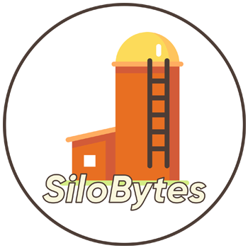
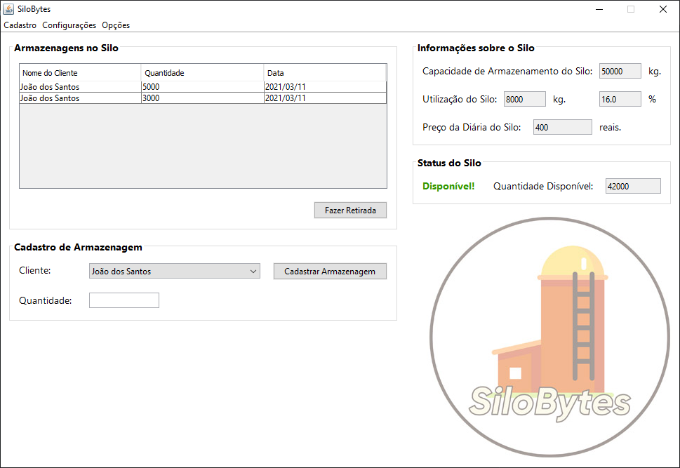

     

  <a href="#-projeto">Projeto</a>&nbsp;&nbsp;&nbsp;|&nbsp;&nbsp;&nbsp;
  <a href="#-tecnologias">Tecnologias</a>&nbsp;&nbsp;&nbsp;|&nbsp;&nbsp;&nbsp;  
  <a href="#-autor">Autor</a>&nbsp;&nbsp;&nbsp;|&nbsp;&nbsp;&nbsp;
  <a href="#memo-licença">Licença</a>

   
  
   Tela Principal do Sistema SiloBytes

## 💻 Projeto

Sistema para controle de armazenamento em um Silo. Onde os usuários fazem o login na aplicação e podem cadastrar clientes, e realizar armazenagens e retiradas no silo.
Todos os cadastros são feitos em arquivos.

O sistema conta com uma interface fácil de usar, com todas as informações necessárias já na tela principal.

## 🚀 Tecnologias

Implementação realizada com a linguagem de programação [Java](https://www.oracle.com/java/) na [IDE NetBeans](https://netbeans.org/).

## 👨‍💻 Autor

[Juan Carlos Cardoso de Oliveira](https://github.com/juanoliveira82) - Estudante do curso de Ciência da Computação na Universidade Estadual do Norte do Paraná (UENP).

## :memo: Licença

Esse projeto está sob a licença **MIT**. Veja o arquivo [LICENSE](LICENSE) para mais detalhes.
